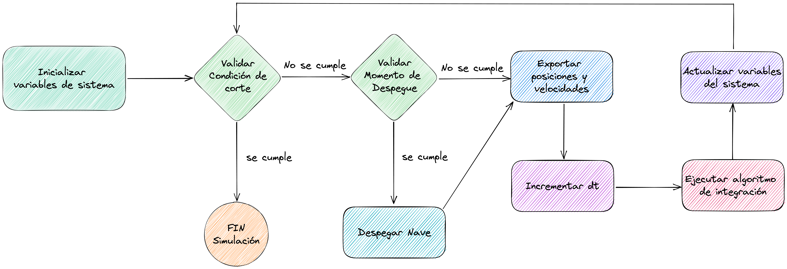

# SS TP4: Dinámica Molecular regida por el paso temporal

Implementación Trabajo Práctico Número 4: Dinámica Molecular regida por el paso temporal para la materia 72.25 - Simulación de Sistemas - Segundo Cuatrimestre 2022.

## Autores

* [Julián Francisco **Arce Doncella**](https://github.com/JuArce)
* [Roberto José **Catalán**](https://github.com/rcatalan98)
* [Gian Luca **Pecile**](https://github.com/glpecile)

## Dependencias

* [Java 17](https://www.oracle.com/java/technologies/javase/jdk17-archive-downloads.html)

## Diagramas de Clases

## Diagrama de flujo

## Presentación

La presentación se encuentra en el directorio `/docs` con el nombre [SdS_TP4_2022Q2G07_Presentación](docs/SdS_TP4_2022Q2G07_Presentación.pdf).
